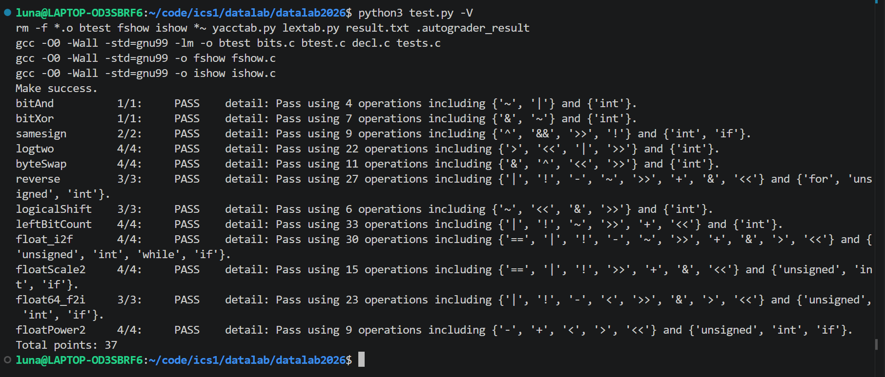
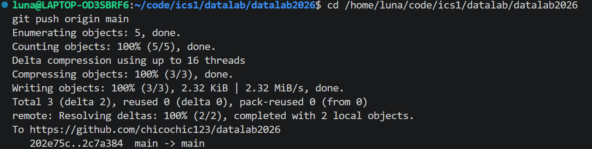

# datalab 报告

姓名：张雪霏

学号：2025203029

学院：高瓴人工智能学院

| 函数 | 得分 | 函数 | 得分 |
| ---------- | ---------- | ---------- | ---------- |
| bitAnd | 1/1 | logicalShift | 3/3 |
| bitXor | 1/1 | leftBitCount | 4/4 |
| samesign | 2/2 | float_i2f | 4/4 |
| logtwo | 4/4 | floatScale2 | 4/4 |
| byteSwap | 4/4 | float64_f2i | 3/3 |
| reverse | 3/3 | floatPower2 | 4/4 |

总分：**37/37**

测试截图（`python3 test.py -V` 与 `git push`）：

## 解题报告

### 亮点

1. `logtwo` / `leftBitCount`：没有循环也没有控制流时，用比较运算的结果当控制流，把“一位一位数”改造成二分查找
2. `float_i2f`：舍入判断写成 `remainder + (M & 1) > cmp`，把“余数大于一半则入”和“恰好一半看尾数奇偶”两类判断压进一次比较，最终正好落在 30/30 个算子的上限内
3. `byteSwap`：发现同一个 `diff` 异或两次等于什么都没做，于是两个字节的写回可以合并成一次
4. `floatPower2`：规格化、非规格化、上溢、下溢四种情况一共只用 9 个算子
5. `float64_f2i`：把 `e == 31` 的溢出边界和“负数刚好等于 -2^31”合并成同一个返回值

### 总的做法

每道题我都是先写数学上的等价形式，看能不能凑成合法算子，再拿剩余的算子预算去压缩写法。整数题的限制最紧，所以主要靠德摩根律把 `|` 换成 `~` 和 `&`，以及把常量提前折算成十六进制；浮点题允许 `if` 和 `while`，难点就转移到 IEEE 754 的各段边界上，我习惯先把符号位、阶码、尾数分别取出来，再按 0、非规格化、规格化、无穷/NaN 分段讨论。

### bitAnd

德摩根律直接把 `&` 换成 `~` 和 `|`：`x & y = ~((~x) | (~y))`。4 个算子，限 7 个。

### bitXor

第一反应是 `((~x) & y) | (x & (~y))`，但这题只给 `~` 和 `&`，`|` 是禁用的，所以还要再套一层德摩根把 `|` 消掉，得到 `(~(x & y)) & (~((~x) & (~y)))`。

化简过程中的收获是换了一个说法来理解它：结果要求“两个位不能同时为 1，也不能同时为 0”，而两个取非后的与正好分别对应这两个条件，不必再机械地套公式。7 个算子，卡在上限。

### samesign

唯一要小心的是 0 既不是正数也不是负数：`samesign(0, 0) = 1`，而 `samesign(0, 正数) = 0`。

所以我把判断写成了一棵决策树：先看 x 是否为 0，是的话答案完全由“y 是否为 0”决定；x 非 0 时再看 y 是否为 0，答案同样由 `Both0` 给出；两个都非 0 才真正比较符号位，用 `(x >> 31) ^ (y >> 31)` 取异或再取非。`(!x) && 1` 这种写法是把“是否为 0”转成 0/1 的整数，方便直接当返回值用。9 个算子，限 12 个。

### logtwo

这是整份作业里我觉得最有意思的一题。一位一位地数显然超预算，而这题只给 `> < >> << |`，既没有 `if` 也没有循环，看起来根本没法做二分查找。转折点是想清楚**比较运算本身就能充当控制流**：

- 最高位的位置是一个 0 到 31 的数，可以写成一个 5 位二进制数，于是问题变成“从高位到低位逐位确定这 5 个 bit”
- 判断 `(v >> 16) > 0` 就是最高位那一个 bit 的二分判定，结果存进 `cmp_16`，再左移 4 位得到移位量，把 `v` 压回低位区间
- 依次做 16 / 8 / 4 / 2 / 1 五轮，每轮都是“先比较、再压缩”
- 最后用 `|` 代替加法把 5 个 bit 拼起来，得到十进制的位置

22 个算子，限 25 个。

### byteSwap

交换两个字节最自然的写法是三次异或，但那样要为两个字节各构造一个 mask，算子直接超了（代码里留了那版写法作对照）。

后来发现其实只需要一个 `diff`：把两个字节取出来算出 `diff = byte_n ^ byte_m`，写回时用 `x ^ (diff << ns) ^ (diff << ms)`。原理是一个值异或两次等于什么都没做，所以“把第一个字节抠掉再写回、把第二个字节抠掉再写回”这两步可以合并成一步。

另一个细节是题目给的是字节号而不是位数，`n << 3` 才是位移量，`0xFF` 用来取出一个字节。11 个算子，限 17 个。

### reverse

思路和 byteSwap 一样是“取出、交换、写回”，只不过这次交换的是第 i 位和第 31 - i 位。用 mask 展开写要 32 组，算子完全不够，所以想到用循环把重复压掉：`i` 从 0 走到 15，每轮交换第 i 位和第 31 - i 位，一次处理两个位。

两个小坑：一是循环条件也得用移位来写，`!(i >> 4)` 等价于 `i < 16`；二是这题不允许调用函数，所以异或也得手搓成 `((~r) & l) | (r & (~l))`，写回用“抠位再取并”的固定套路 `v = ((~v) & (diff << k)) | (v & (~(diff << k)))`。27 个算子，限 30 个。

### logicalShift

难点只有一个：算术右移会在高位补符号位，所以需要一个“前 n 位是 0、其余位是 1”的 mask。

中间试错了两条路：想把全 1 的首位改成 0，但构造不出干净的 mask；想用左移构造第 n 位，但题目不给 `-`，拿不到 `32 - n`。最后发现两次移位就够了：`~(1 << 31 >> n << 1)`。`1 << 31` 得到 `0x80000000`，算术右移 n 位之后高位全是补进来的 1，再左移 1 位刚好把这些 1 又挤出去，取反就是需要的 mask。只有 6 个算子，限 20 个。

### leftBitCount

数前导 1 等价于取反之后数前导 0，再用 32 去减“最高位 1 的位置”，所以核心还是找最高位，做法和 `logtwo` 一样是五轮二分。

区别在于这题不给 `>`，只给 `!`，于是把每个比较写成 `!(!(v >> k))`，用两次取非把“非零”压成 1，同样可以当移位量用。另外 `x` 全为 1 时 `~x` 是 0，二分过程中每个比较都会失败，所以要单独用 `IsV0 = !v` 在最后补回来。收尾的 `31 + ((~highest_0) + 1) + IsV0` 是用补码手搓的减法。33 个算子，限 50 个。

### float_i2f

整体是固定的三段：符号位取最高位留着，阶码写成 `158 - i`（`i` 是前导 0 的个数，把 `127 + 31 - i` 提前并成一个常数），尾数按有效位长度分两种处理。

- `x == 0` 单独返回；负数用 `(~x) + 1` 取绝对值，避免中途带着符号跑
- 有效位不超过 24 位（`i > 7`）：左移对齐、掩码掉最高位，剩下的低位本来就是 0，不用舍入
- 有效位超过 24 位（`i <= 7`）：必须把尾数舍入到 23 位

舍入这块改过一版。最初写的是 GRS（Guard / Round / Sticky），但左移 32 位在 C 里是未定义行为，而且要写很多 `if`，于是换成提取末 `drop` 位作为 remainder、和“最高位是 1 其余全 0”的 `cmp` 比大小：大于则入，小于则舍，正好等于时看尾数末位的奇偶。

最后一步是这次印象最深的地方：把“大于则入”和“等于看奇偶”两类判断合并成一次比较 `remainder + (M & 1) > cmp`，利用 `M & 1` 只能是 0 或 1 的性质。省下来的算子刚好让这道题落在 30/30 的上限内。

还有一个边界被合并掉了：原来单独处理 `i == 31`（担心移 32 位越界），后来发现改成 `x << (i - 8)` 之后，`i == 31` 时实际只移 23 位，本来就不会越界，那段特殊处理就删掉了。舍入进位导致尾数溢出 23 位时，把尾数清 0、阶码加 `0x800000`。

### floatScale2

题意是把参数当成单精度浮点看，返回它乘 2 之后的位模式，所以按阶码分段：

- 阶码 255：本身是无穷或 NaN，原样返回
- 阶码 254：乘 2 一定变无穷，直接返回 `符号位 | 0x7F800000`
- 阶码 0：非规格化数或 0。0（含 -0）返回自己；否则尾数左移 1 位即可，非规格化数乘 2 就是尾数翻倍，不用动阶码
- 其它：阶码加 1，尾数不变

15 个算子，限 30 个。

### float64_f2i

先算绝对值、最后按符号位取负，这样中间过程不用处理负数。阶码 `e < 0` 时数值小于 1，按向零舍入直接返回 0；否则用 `1 << e` 造出整数部分，再按尾数相对第 20 位的位置左右移动拼进去：`e < 21` 时把尾数右移截断，`e >= 21` 时左移并补上低位那段 `uf1`。

溢出边界合并得比较巧（注释里推过一遍）：`e >= 32` 一定溢出；而 `e == 31` 时正数一定溢出，负数只有尾数为 0 时才刚好等于 -2^31，这个值本身又正好是 `0x80000000`，和题目要求的溢出返回值相同，于是两种情况可以一起返回。23 个算子，限 60 个。

### floatPower2

直接按阶码范围分四段：`x > 127` 上溢，返回 `+INF`；`x < -149` 太小，返回 0；`-126` 到 `127` 是规格化数，`(x + 127) << 23` 就是位模式；`-149` 到 `-127` 是非规格化数，2 的幂落在最低位上，也就是 `1 << (149 + x)`（`2^-149` 对应最末一位）。9 个算子，限 30 个。

## 收获和感悟

位运算题最花时间的不是想数学式子，而是算子预算和未定义行为：同样正确的写法，算子数可能差好几倍，而左移 32 位、有符号溢出这类地方又必须提前避开。

收获最大的是“比较结果就是控制流”这个想法，`logtwo` 和 `leftBitCount` 都是靠它把线性的枚举变成二分，我觉得这是这次 lab 里最有意思的部分。写完再回看，对一个数的位级表示也比以前敏感了一些。

## 参考的重要资料

- 课程课件（位运算与 IEEE 754 浮点数表示部分）
